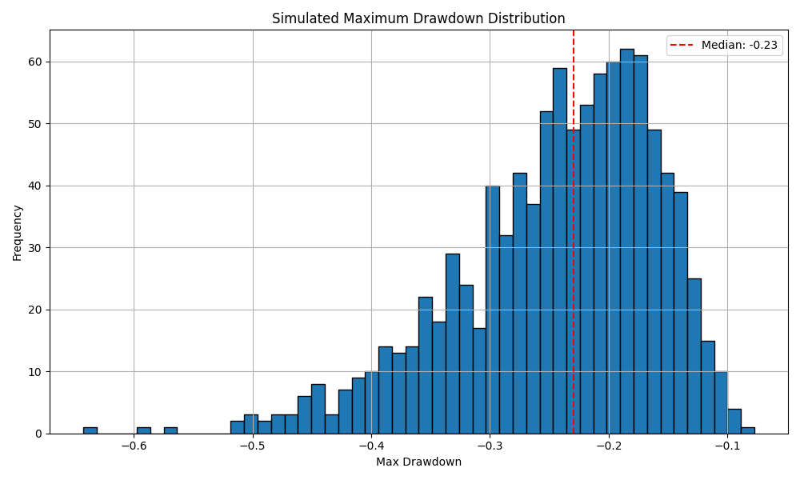

# Portfolio Risk Simulator

This project uses Python to simulate the forward returns of a stock portfolio using Monte Carlo methods. It estimates portfolio volatility and visualizes the distribution of potential drawdowns under uncertain market conditions.


### Key Features

- **Data Source:** Pulls historical price data via `yfinance`
- **Assets:** Includes an equally weighted portfolio of AAPL, MSFT, GOOGL, and AMZN
- **Metrics Calculated:**
  - Daily portfolio returns
  - Mean and standard deviation (volatility)
  - Maximum drawdown across 1,000 simulated future price paths
- **Simulation Details:**
  - Monte Carlo method
  - 252 trading days (1 year)
  - 1,000 simulation paths
- **Visualization:** Plots a histogram of maximum drawdowns to assess risk exposure

### Skills Demonstrated

- Time series analysis
- Monte Carlo simulation
- Portfolio construction and risk modeling
- Data visualization with `matplotlib`
- API-based financial data access (`yfinance`)

### Sample Output



### Dependencies

- `yfinance`
- `numpy`
- `pandas`
- `matplotlib`

Install with:

```bash
pip install yfinance numpy pandas matplotlib
